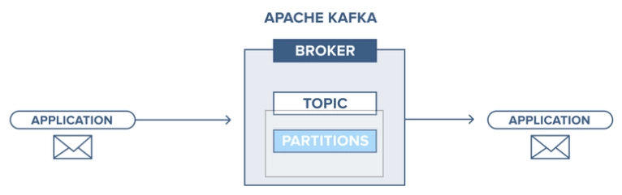
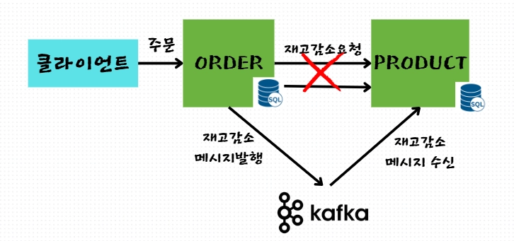
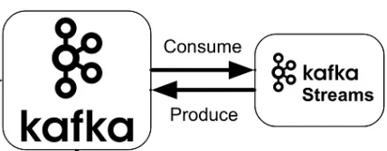

## 카프카의 개요

- 카프카는 데이터를 주고 받는 중간 다리 역할을 한다. 
- 카프카를 사이에 두고, 생산자는 카프카에 메시지 발행, 유저는 카프카로부터 데이터를 수신한다.

### 카프카의 주요 특장점

- 메시지는 토픽 기반의 비구조화된 데이터
- 대규모 복제 아키텍처를 통한 고가용성 확보
- 고성능의 비동기 메시징 처리 시스템
- 메시지 임시보관과 재처리 메커니즘을 통해 안정성 확보

### 카프카의 사용 사례
마이크로 서비스의 통신(MSA)

- MSA서버간의 HTTP API 호출 기반 동기 통신
    - 상대방 서버가 불능상태일때 API요청을 받지 못해, 요청이 유실될 수 있는 가능성
    - 응답 결과를 기다려야 하는 동기적 처리로 인해 서버 성능저하

- MSA서버간 카프카를 통한 메시지 발행을 통한, 비동기적 통신
    - kafka에 물리적으로 메시지가 저장이 되어 유실 가능성이 낮다.
    - 비동기 발행으로 성능 향상 가능

로그/이벤트 수집
- 여러 서버에서 대량으로 발생하는 로그를 한곳으로 모으고 분석한다.
- AI학습 목적의 데이터 취합도 로그/이벤트 수집과 비슷한 구조다.

데이터 파이프라인(kafka connect)
- 특정 시스템의 데이터를 모아 다른 시스템에 전달 ETL목적으로 카프카 활용
- 카프카에서 제공되는 kafka connect 별도의 송수신 장비 없이 카프카와 다양한 외부시스템을 연결해주는 전용 서버

실시간 데이터 변환 및 집계
- 받은 메시지를 집계 또는 가공해서 데이터 흐름을 만들어 내는 작업이다.
- 데이터 변환 관련해서 kafka streams 라이브러리 제공한다.

카프카 스트림을 이용할 경우 일반적인 메시지 수신 -> 재가공 -> 재발행 절차는 동일하다.
 카프카 스트림은 메시지 수신, 재가공, 재발행에서 발생되는 트랜잭션 보장에 대한 편의를 제공한다.