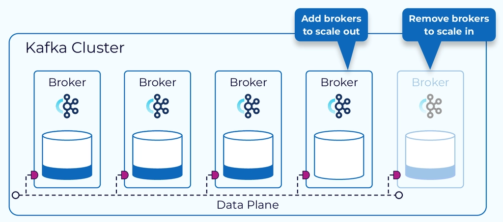
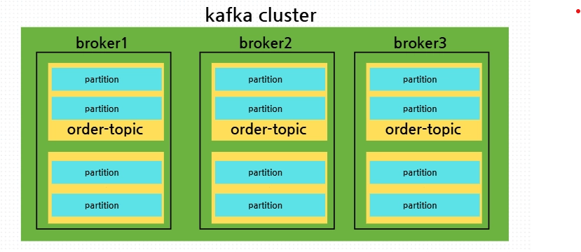
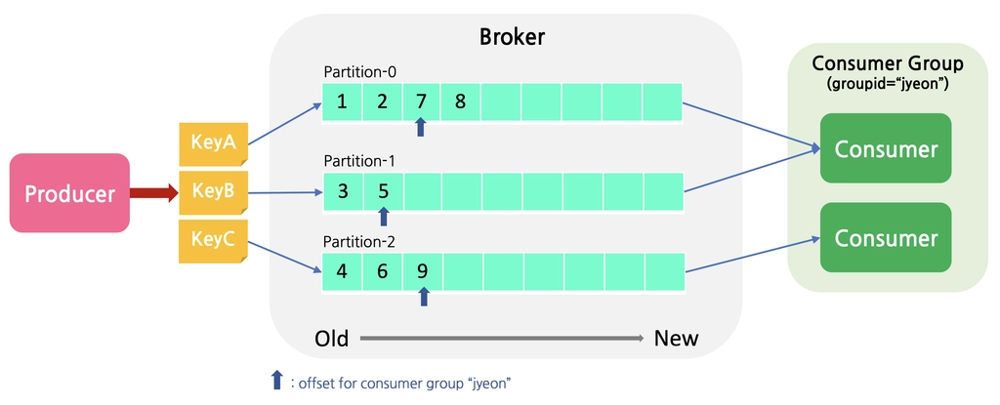
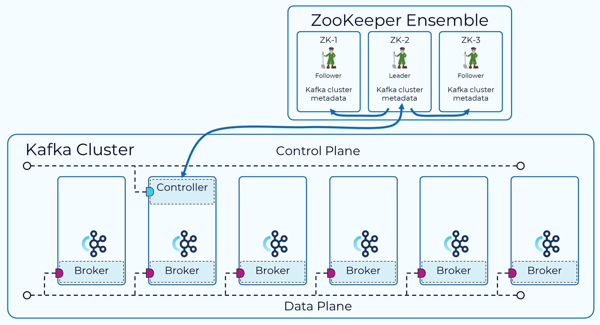

## 카프카 클러스터 구조

### 브로커
- 카프카의 실질적인 서버이다. 클러스터내의 서버 인스턴스를 의미한다.
- 브로커는 producer(발행자)/consumer(수신자)의 요청 처리 및 메시지 저장, 관리이다.
- 카프카는 고가용성 메시징 시스템으로서 장애를 대비한 분산, 복제 구조
    - 여러대의 브로커가 모여서 클러스터를 구성한다.
- 브로커의 내부 구조
    - 각 브로커 공간내 파티션에 메시지를 저장하고 관리
    - 파티션은 메시지가 실질적으로 저장되는 물리적인 단위
    - 이 파티션을 논리적 단위로 묶은 topic 단위로 메시지를 관리한다.

> 즉 여러대의 브로커가 모인것을 클러스터라고 하며, 브로커의 내부는 메시지를 저장하고, 토픽 단위로 메시지를 관리한다.

토픽 단위로 저장한다는 말은 뭘까?

- 토픽은 카프카에 발행되는 메시지가 기록되는 논리적인 단위이다.
- 토픽 이름은 카테고리처럼 작동하며, 발행하고, 특정 토픽에서 메시지를 read한다.
- 각 토픽은 여러개의 파티션을 포함하고, 토픽은 여러 브로커에 걸쳐있을 수 있는 구조다.

- 여기서 회색 박스는 토픽이고, 안에 파티션이 3개가 있다.
- 발행자에 의해 토픽이 발행되면, 브로커는 토픽에 소속되어있는 파티션에 분산하여 메시지를 저장한다.
- 각 파티션마다 메시지에 시간 순서가 틀어질 일은 없다. 컨슈머가 가져갈때, 토픽 전체에서 가져가기때문에 시간 순서는 보장이 되지않는다.
- 토픽은 하나씩 순서대로 꺼내는것이 아니라, 시간 순서가 뒤틀려있을 수 있다.

- 키 A, B등 매핑을 시켜놓으면 파티션마다 각각 저장이 되게 된다.
- 기본 원리는 hash값을 사용하게 된다.

> stock-topic 같은 주식 주문 토픽에 종목별 주문 요청을 시간순으로 저장해야한다면, 종목명을 키값으로 주문 요청 메시지를 발행한다.

**파티션 개수 설정**
- 시스템 규모 고려
    - 시스템 규모가 크다면 단일 파티션만으로는 메시지 처리 성능 저하
    - 시스템 규모에 따라 많은 파티션과 많은 컨슈머를 두고 메시지 병렬 처리 필요
- key의 종류 고려
    - key 종류에 따른 파티션 개수 설정 필요
    - key의 종류가 매우 적다면, 파티션이 많다 하더라도 몇몇 파티션에만 메시지가 쌓인다.
- 미래 확장 계획 여부
    - 미래 확장 여부를 고려해서 초기에 여유있는 파티션 세팅이 필요하다.
    - key값을 사용하는 토픽을 경우 구조적으로 변경이 어렵다.

> 삼성전자인지 LG인지 파티션 0에 같이 쌓여도 괜찮다. 파티션에 대해, 키에대해 시간 순서가 보장이 되기 때문이다.

**메시지**
- Json, XML, 단순 문자열 등의 특정 형태를 가진다.
- 메시지는 보통 1MB크기이다. 별도 설정이 필요하다 크기를 늘리려면, 카프카는 세그먼트 단위로 일정시간을 두고 있어서, 영구 저장소는 아니다.
- Json도 많이 쓰이지만, 에이브로(avro)도 많이 쓰인다.

> 에이브로는 카프카에서 굉장히 많이 쓰이는 메시지 구조이다. 표준 스키마를 제공한다. 
기존 Json방식에선 프로듀서와 커슈머 데이터가 맞지않으면 오류가 발생했지만, 에이브로는 직렬화 및 역직렬화시 스키마를 강제한다.

**Zookeeper의 역할**

- 주키퍼는 분산 아키텍처를 위한 코디네이션 서비스이다.
- 카프카 클러스터의 상태를 관리하는것이다. 어떤 브로커가 활성 상태인지, 어떤 브로커가 다운 되었는지 추적한다.