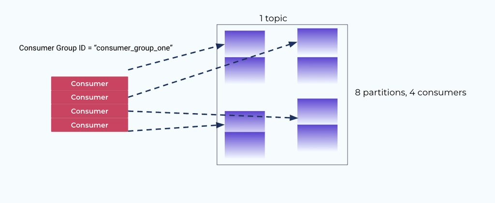
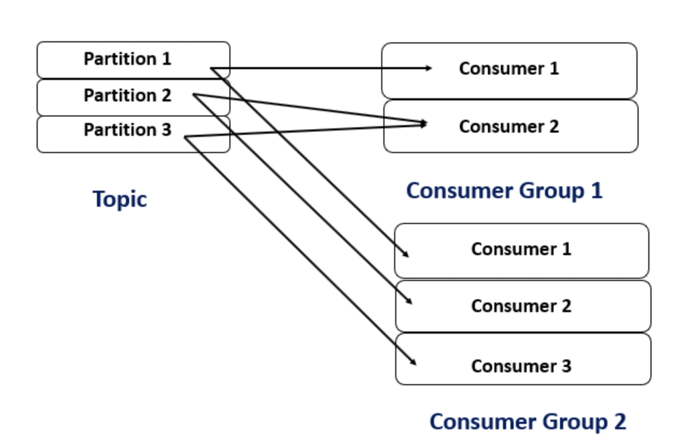
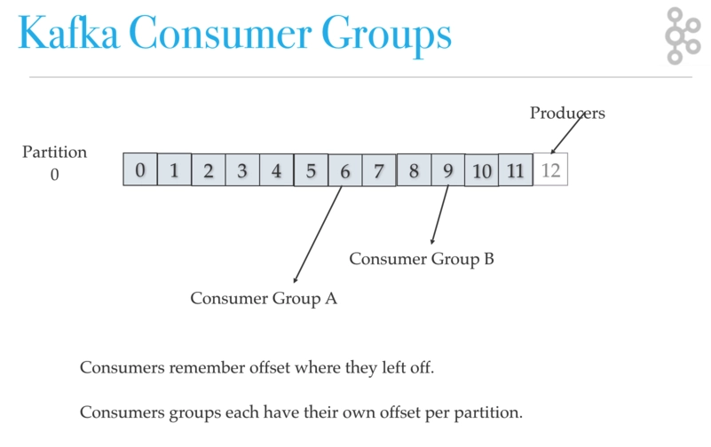

## 프로듀서와 컨슈머

### 프로듀서
- 카프카 프로듀서는 메시지를 발행하는 주체로서, 보통 프로듀서 역할을 하는 애플리케이션 서버에서 메시지를 카프카로 발행한다.
- Spring kafka등 대부분 카프카 관련 라이브러리는 메시지 발행시에 비동기 방식으로 동작한다.
- 카프카는 기본적으로 발행된 메시지를 round-robin 알고리즘으로 토픽안의 파티션에 분산하여 저장한다.
- Key를 지정하여 발행하면, 브로커는 해시 기반으로 특정 파티션에 라우팅하여서 저장한다.

### 컨슈머
- 컨슈머는 Kafka 브로커로부터 메시지를 구독하여 가져오는 주체이다.

**컨슈머 그룹**
- 컨슈머 그룹이란 같은 그룹ID를 가진 컨슈머들이 하나의 그룹을 이루어 하나 이상의 토픽을 함께 구독하는 논리적인 단위이다.

- 한 컨슈머 그룹 내의 여러 컨슈머는 토픽의 파티션을 함께 나누어 점유한다.
    
    - 주문 서버에서 발행된 메시지를 상품서버에서 재고처리를 위해 컨슈머
    - 이때 상품 서버는 트래픽에 따라 1대가 아닌 n대로 확장 가능하다.
    - n대의 서버를 같은 그룹 ID로 묶어 파티션 분담하여 컨슈머 하도록 설정한다.

- 여러 컨슈머 그룹이 한 토픽을 구독할 경우 독립적으로 파티션 점유
    
    - 주문 서버에서 발행된 메시지를 상품서버, 주문통계서버, 알림서버에서 컨슈머한다.
    - 각 서버는 같은 메시지를 각 컨슈머해야하므로 다른 그룹 ID로 설정한다.

### Offset
- offset(오프셋) 이란, 토픽의 메시지의 순서를 나타내는 고유한 번호

- 컨슈머 그룹에서의 offset 관리
    - 컨슈머 그룹에서 메시지를 정상적으로 수신 후 처리하게 되면 offset을 커밋하여 offset값 이동처리
    - 컨슈머 그룹마다 한 토픽에 대한 자신만의 고유의 커밋된 오프셋 관리
    

- offset 주요 옵션
    - offset 오토커밋 설정 
    메시지를 주기족으로 수신하고 자동 커밋하여 Offset이동한다. 스프링 카프카의 컨슈머 기본값은 true이다.

- auto-offset-reset=earliest
    - 토픽 내 가장 오래된 메시지부터 읽음 설정
    - 새로운 컨슈머그룹이 이전 메시지를 읽어야 하는 경우 설정
    - 예시)
        - 로그분석서버
        - 일반적으로는 과거의 로그도 분석해서 처리 함
- auto-offset-reset=latest
    - 토픽 내 들어오는 새 메시지부터 읽음 설정(default설정)
    - 새로운 컨슈머그룹이 서버 실행 이후 최신의 메시지만 읽어야 하는 경우 설정
    - 예시)
        - 알림서버
        - 과거 메시지까지 알림을 줄 경우 혼선 발생