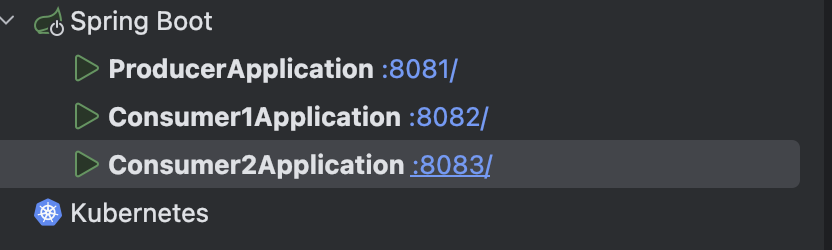

## 2대의 서버실행 후 컨슈머 그룹별 파티션할당 확인




컨슈머 그룹 아이디를 다르게 설정해서 하게되면, 각각 컨슈머로 전파가 된다.

```java
테스트3. auto-offset-reset설정 : 컨슈머그룹ID가 다를때 earliest는 과거의 메시지까지, latest는 최신의 메시지만
```

earliest로 서버를 새로 시작하게되면 전것들도 전부 가져오게된다.

- 컨슈머2개가 같은 그룹ID를 가지고 같은 topic을 listen 경우
    - 파티션 n개중 n/2개씩 나누어서 consume
    - 이 경우 컨슈머그룹끼리 offset 정보를 공유하므로 메시지는 총 1번만 수신
- 컨슈머2개가 다른 그룹ID를 가지고 같은 topic을 listen 경우
    - 이 경우 컨슈머그룹별로 offset관리되므로 2개의 컨슈머가 메시지를 각각 수신
        - 메시지 전파 효과 발생
        - redis의 pub/sub 기능과 유사. redis에서는 한번 발송된 메시지는 redis내부에 저장되지 않음
- auto-offset-reset 옵션
    - 새로운 컨슈머그룹이 이전 메시지 또는 최신 메시지를 수신할지 설정
    - auto-offset-reset: earliest
        - 로그분석처럼 과거의 기록도 필요한 경우
        - 설정1)한번 실행됐던 그룹ID는 카프카 내부에 저장되므로, 그룹ID 변경
        - 설정2)kafka Bean객체 정보에 auto-offset-reset 설정 추가
    - auto-offset-reset: latest (default)
        - 알림서버처럼 최신의 메시지만 필요한 경우